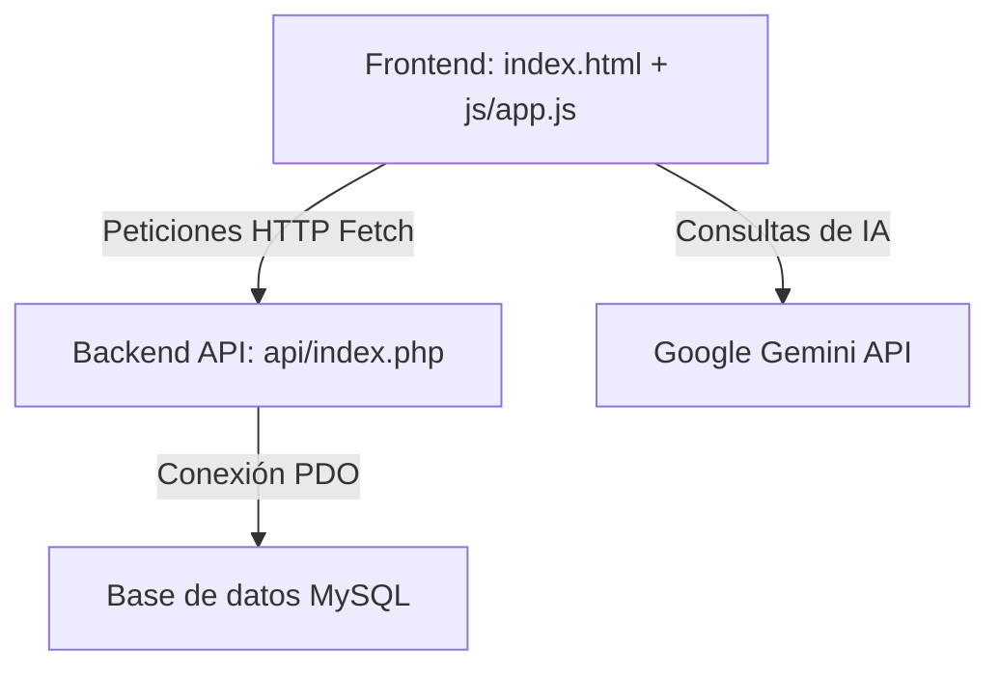
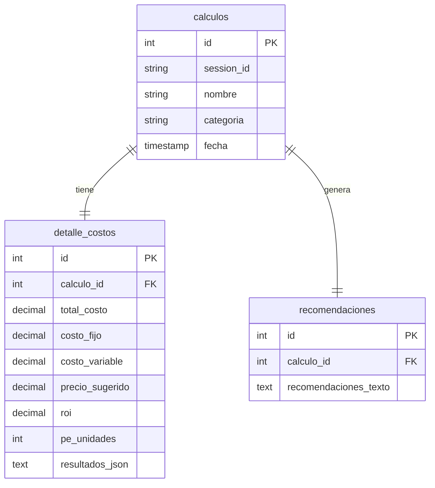

# Documentación Técnica del Sistema de Costos y Presupuestos (ControlCostos AI)

Este documento detalla la arquitectura, estructura de archivos, modelo de base de datos, flujos de API e integración con Inteligencia Artificial del sistema **ControlCostos AI**.

---

## 1. Arquitectura General del Sistema

El sistema está diseñado bajo una arquitectura de **Aplicación de una Sola Página (SPA)** para el Frontend y una **API REST MVC ligera en PHP** para el Backend.



### Tecnologías Utilizadas
* **Frontend**: HTML5, CSS3 personalizado, JavaScript Vanilla, [Chart.js](https://www.chartjs.org/) (gráficos interactivos).
* **Backend**: PHP 7.4+ nativo (sin frameworks), Programación Orientada a Objetos, PDO para la base de datos.
* **Inteligencia Artificial**: API de Google Gemini (`gemini-2.5-flash`).
* **Base de Datos**: MySQL 5.7+ / 8.0+.
* **Despliegue**: Docker + Railway.

---

## 2. Estructura del Código Fuente

```text
costos_system/
│
├── api/                          # Backend API REST PHP
│   ├── config/
│   │   └── Database.php          # Configuración y conexión a MySQL (compatible Local y Railway)
│   ├── controllers/
│   │   ├── CalculoController.php # Controlador para manejar solicitudes de cálculos
│   │   └── DashboardController.php# Controlador para estadísticas de panel
│   ├── helpers/
│   │   └── Response.php          # Formateador de respuestas JSON de la API
│   ├── models/
│   │   └── Calculo.php           # Modelo de base de datos y consultas SQL
│   ├── services/
│   │   ├── FinancialService.php  # Fórmulas de cálculo matemático (ROI, Punto de Equilibrio)
│   │   └── GeminiService.php     # Conector para recomendaciones de Gemini
│   ├── index.php                 # Enrutador principal de la API REST
│   └── test_env.php              # Diagnósticos de variables de entorno (desarrollo)
│
├── css/
│   └── styles.css                # Diseño personalizado y variables CSS (Modo Oscuro/Claro)
│
├── js/
│   ├── app.js                    # Lógica del cliente, SPA, chatbot e integración con Chart.js
│   └── restaurante_chart.js      # Configuraciones de gráficos financieros
│
├── .gitignore                    # Exclusiones de Git
├── composer.json                 # Activador de entorno PHP en Railway
├── Dockerfile                    # Contenedor Apache/PHP para Railway
├── index.html                    # Interfaz de usuario (UI) principal
└── README.md                     # Manual básico
```

---

## 3. Modelo de Base de Datos (MySQL)

La base de datos se genera de manera automática la primera vez que la aplicación establece conexión. Cuenta con las siguientes 3 tablas:



### Definición de Tablas (SQL)

1. **`calculos`**:
   * `id`: Clave primaria autoincremental.
   * `session_id`: ID de sesión único del navegador para asociar los cálculos del usuario.
   * `nombre`: Nombre del producto o proyecto (ej: "Hamburguesa Gourmet").
   * `categoria`: Categoría del negocio (ej: "Restaurante", "Carpintería").
   * `fecha`: Fecha de registro automático.

2. **`detalle_costos`**:
   * `id`: Clave primaria autoincremental.
   * `calculo_id`: Clave foránea referenciando a `calculos.id`.
   * `total_costo`: Costo unitario total acumulado.
   * `costo_fijo`: Costo indirecto fijo asignado por unidad.
   * `costo_variable`: Costos de materiales y mano de obra.
   * `precio_sugerido`: Precio de venta estimado en base al porcentaje de utilidad.
   * `roi`: Retorno de Inversión calculado.
   * `pe_unidades`: Punto de equilibrio en unidades de venta mensuales.
   * `resultados_json`: Payload JSON completo con el desglose detallado de los materiales para futuros reportes.

3. **`recomendaciones`**:
   * `id`: Clave primaria autoincremental.
   * `calculo_id`: Clave foránea referenciando a `calculos.id`.
   * `recomendaciones_texto`: Texto plano formateado con las recomendaciones financieras generadas por Gemini.

---

## 4. Endpoints de la API REST PHP

Todas las peticiones son despachadas a través de `api/index.php` utilizando el parámetro de consulta `route`.

### `POST /api/index.php?route=calculos/create`
* **Descripción**: Procesa y almacena un nuevo cálculo financiero y solicita las recomendaciones a Gemini.
* **Payload (JSON)**:
  ```json
  {
    "session_id": "saas_12345",
    "apiKey": "ghp_...",
    "raw_json": {
      "nombre": "Mesa de Roble",
      "categoria": "Carpintería",
      "costo_materiales": 150,
      "mano_obra": 50,
      "costos_indirectos": 30,
      "utilidad": 35,
      "ventas_estimadas": 10
    }
  }
  ```

### `GET /api/index.php?route=calculos/list&session_id={id}`
* **Descripción**: Devuelve el historial de cálculos guardados asociados a la sesión actual del usuario.

### `GET /api/index.php?route=calculos/detail&id={id}`
* **Descripción**: Obtiene la información financiera completa y recomendaciones detalladas de un cálculo por su ID.

### `GET /api/index.php?route=dashboard/stats&session_id={id}`
* **Descripción**: Genera resúmenes agregados (Márgenes de ganancia, inversión acumulada y distribución de categorías) para el dashboard del usuario.

---

## 5. Integración con Gemini AI

La inteligencia artificial funciona como un asesor conversacional y motor de análisis de datos estructurados:

1. **Flujo de Conversación**: El usuario chatea con el bot sobre los detalles de su negocio.
2. **Generación de JSON estructurado**: Cuando la conversación se completa, Gemini genera los datos financieros estructurados dentro de etiquetas `<chart-data>` (por ejemplo, `<chart-data>{"nombre": "Ejemplo"...}</chart-data>`).
3. **Persistencia**: El frontend extrae el JSON, realiza los cálculos financieros matemáticos en el backend mediante PHP y guarda la sesión.
4. **Recomendaciones**: El backend vuelve a invocar a Gemini (`GeminiService`) pasándole los números exactos calculados para obtener consejos accionables con el prefijo `CHECK` (ej: *"CHECK Si reduces los materiales un 5%, tu utilidad subirá un 12%"*).

---

## 6. Despliegue y Configuración

### Configuración en Local (XAMPP)
1. Clona la carpeta del proyecto en `C:\xampp\htdocs\costos_system`.
2. Asegúrate de tener activado el módulo Apache y MySQL en el Panel de XAMPP.
3. Abre tu navegador en `http://localhost/costos_system/`.
4. El sistema se conectará a `localhost` usando el usuario `root` sin contraseña y creará automáticamente la base de datos `controlcostos_db`.

### Configuración en la Nube (Railway)
1. Sube tu carpeta del proyecto a un repositorio de GitHub.
2. En Railway, crea un nuevo proyecto conectando tu repositorio.
3. Agrega un servicio de **MySQL Database** en el mismo proyecto de Railway.
4. En el servicio de tu aplicación web (`Costos`), ve a la pestaña **Variables** y agrega una variable llamada `MYSQL_URL` con el valor `${{ MySQL.MYSQL_URL }}`.
5. Railway compilará el contenedor utilizando el `Dockerfile` y conectará automáticamente el sistema de manera segura.
